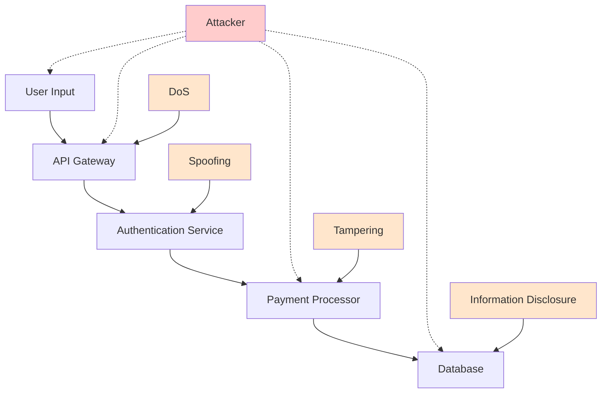

# Performance and Security Analysis

## Introduction
This workflow prompt performs specialized performance and security analysis of feature specifications, generating threat models based on requirements and design patterns, identifying performance bottlenecks, assessing security vulnerabilities, and providing mitigation recommendations. It ensures features are designed with robust performance and security considerations from the specification stage.

**Intent**: Proactively identify and address performance and security concerns before implementation to prevent costly redesigns and security vulnerabilities.

**Context**: Use when analyzing high-performance features, security-critical components, or conducting comprehensive risk assessments for production-ready systems.

## Constraints and Guidelines

### Input Requirements
- **MANDATORY**: Feature specification directory with requirements, design, and task documents
- **OPTIONAL**: Analysis focus (performance-only, security-only, comprehensive-analysis, compliance-focus)
- **OPTIONAL**: Target environment context (cloud, on-premise, hybrid, mobile, web)
- **OPTIONAL**: Compliance requirements (GDPR, HIPAA, SOC2, PCI-DSS, industry-specific)
- **OPTIONAL**: Performance benchmarks and security baseline requirements

### Processing Constraints
1. **Threat Model Scope**: Generate comprehensive threat models covering all attack vectors and performance risks
2. **Standards Compliance**: Ensure analysis aligns with industry security standards and performance best practices
3. **Risk Prioritization**: Classify threats and performance issues by severity and likelihood
4. **Mitigation Feasibility**: Provide practical, implementable security and performance recommendations
5. **Monitoring Integration**: Generate monitoring and observability requirements for ongoing validation

### Output Constraints
1. **Structured Threat Models**: Generate systematic threat analysis using established methodologies (STRIDE, PASTA)
2. **Performance Profiles**: Create detailed performance requirement profiles with benchmarks and thresholds
3. **Mitigation Roadmaps**: Provide actionable security and performance improvement plans
4. **Compliance Mappings**: Map requirements to relevant compliance standards and regulations
5. **Monitoring Specifications**: Define monitoring, alerting, and observability requirements

## Performance and Security Analysis Process

### Phase 1: Specification Analysis and Risk Surface Identification

**Feature Risk Profile Assessment:**
1. Parse requirements, design, and tasks to identify security and performance-sensitive areas
2. Classify feature components by risk level and exposure surface
3. Identify data flows, external interfaces, and integration points
4. Assess user access patterns, privilege levels, and data sensitivity

**Attack Surface Analysis:**
1. Identify all external interfaces and entry points (APIs, UIs, integrations)
2. Map data inputs, outputs, and processing flows
3. Analyze authentication and authorization touchpoints
4. Assess third-party dependencies and integration risks

**Performance Critical Path Identification:**
1. Identify performance-sensitive operations from requirements and design
2. Map data processing workflows and computational complexity
3. Analyze resource usage patterns (CPU, memory, I/O, network)
4. Identify potential bottlenecks and scalability constraints

**Compliance Requirement Mapping:**
1. Extract compliance-relevant requirements from specifications
2. Map features to applicable regulations and standards
3. Identify data protection and privacy requirements
4. Assess audit trail and logging needs

**Output Requirements:**
- Comprehensive risk profile with attack surface mapping
- Performance critical path analysis with bottleneck identification
- Compliance requirement matrix with regulatory mapping
- Security and performance risk classification

### Phase 2: Threat Modeling and Security Vulnerability Assessment

**STRIDE Threat Model Generation:**
1. **Spoofing**: Analyze authentication and identity verification vulnerabilities
2. **Tampering**: Assess data integrity and modification attack vectors
3. **Repudiation**: Evaluate logging, audit trails, and non-repudiation controls
4. **Information Disclosure**: Analyze data exposure and confidentiality risks
5. **Denial of Service**: Assess availability and resource exhaustion vulnerabilities
6. **Elevation of Privilege**: Evaluate authorization and access control weaknesses

**Data Flow Security Analysis:**
1. Map all data flows through the system architecture
2. Identify data at rest, in transit, and in processing security requirements
3. Analyze encryption needs and key management requirements
4. Assess data classification and handling procedures

**Authentication and Authorization Assessment:**
1. Evaluate authentication mechanisms and strength requirements
2. Analyze authorization models and access control implementation
3. Assess session management and token security
4. Identify privilege escalation and access bypass risks

**Input Validation and Injection Attack Analysis:**
1. Identify all input sources and validation requirements
2. Assess SQL injection, XSS, and command injection vulnerabilities
3. Analyze API security and parameter tampering risks
4. Evaluate file upload and processing security controls

**Output Requirements:**
- Complete STRIDE threat model with risk ratings and mitigation strategies
- Data flow security analysis with encryption and protection requirements
- Authentication and authorization security assessment
- Input validation and injection attack vulnerability analysis

### Phase 3: Performance Analysis and Bottleneck Identification

**Computational Complexity Analysis:**
1. Analyze algorithms and data processing operations for complexity
2. Identify O(n²) or higher complexity operations requiring optimization
3. Assess database query complexity and optimization needs
4. Evaluate caching opportunities and data access patterns

**Resource Utilization Assessment:**
1. **CPU Performance**: Identify CPU-intensive operations and optimization opportunities
2. **Memory Usage**: Analyze memory allocation patterns and potential memory leaks
3. **I/O Performance**: Assess disk and network I/O patterns and optimization needs
4. **Database Performance**: Evaluate query performance and indexing requirements

**Scalability and Load Analysis:**
1. Identify components that may not scale horizontally
2. Analyze concurrent user support and load distribution
3. Assess resource contention and locking mechanisms
4. Evaluate caching strategies and data consistency requirements

**Performance Requirement Validation:**
1. Extract performance requirements from acceptance criteria
2. Validate feasibility of performance targets given design constraints
3. Identify missing performance requirements for critical operations
4. Assess monitoring and measurement strategies for performance validation

**Output Requirements:**
- Computational complexity analysis with optimization recommendations
- Resource utilization assessment with capacity planning guidance
- Scalability analysis with horizontal and vertical scaling strategies
- Performance requirement validation with benchmark specifications

### Phase 4: Security Controls and Mitigation Strategy Development

**Security Control Framework Mapping:**
1. Map identified threats to appropriate security controls (NIST, ISO 27001)
2. Prioritize security controls by risk level and implementation effort
3. Identify compensating controls for high-risk areas
4. Assess security control effectiveness and coverage gaps

**Encryption and Data Protection Strategy:**
1. Define encryption requirements for data at rest and in transit
2. Specify key management and rotation procedures
3. Identify data masking and anonymization requirements
4. Design secure data backup and recovery procedures

**Access Control and Authentication Design:**
1. Design robust authentication mechanisms (MFA, SSO, certificates)
2. Implement principle of least privilege access controls
3. Design secure session management and token handling
4. Plan user account lifecycle and privilege management

**Security Monitoring and Incident Response:**
1. Define security event logging and monitoring requirements
2. Design intrusion detection and prevention strategies
3. Plan incident response procedures and escalation paths
4. Establish security metrics and KPI monitoring

**Output Requirements:**
- Comprehensive security control framework with implementation priorities
- Encryption and data protection strategy with technical specifications
- Access control and authentication design with implementation guidelines
- Security monitoring and incident response plan

### Phase 5: Performance Optimization and Monitoring Strategy

**Performance Optimization Recommendations:**
1. **Database Optimization**: Query optimization, indexing strategies, connection pooling
2. **Caching Strategy**: Multi-level caching, cache invalidation, distributed caching
3. **Code Optimization**: Algorithm improvements, memory management, asynchronous processing
4. **Infrastructure Optimization**: Load balancing, CDN usage, resource scaling

**Performance Monitoring and Observability:**
1. Define performance metrics and SLA thresholds
2. Design application performance monitoring (APM) integration
3. Plan performance testing and benchmark validation
4. Establish performance alerting and escalation procedures

**Capacity Planning and Scaling Strategy:**
1. Design auto-scaling policies and resource allocation
2. Plan capacity monitoring and growth prediction
3. Define resource optimization and cost management strategies
4. Establish performance baselining and trend analysis

**Performance Testing Strategy:**
1. Define load testing scenarios and performance benchmarks
2. Plan stress testing and failure condition validation
3. Design performance regression testing procedures
4. Establish continuous performance monitoring in CI/CD

**Output Requirements:**
- Performance optimization roadmap with specific improvement strategies
- Comprehensive monitoring and observability implementation plan
- Capacity planning and scaling strategy with automation recommendations
- Performance testing strategy with benchmark validation procedures

## Performance and Security Analysis Output Schema

### Analysis Report Structure
```json
{
  "analysis_timestamp": "2025-07-22T20:15:00Z",
  "feature_id": "payment-processing",
  "analysis_scope": "comprehensive-analysis",
  "target_environment": "cloud-microservices",
  "compliance_requirements": ["PCI-DSS", "GDPR"],
  
  "risk_assessment_summary": {
    "overall_security_risk": "high",
    "overall_performance_risk": "medium",
    "critical_vulnerabilities": 3,
    "high_performance_risks": 2,
    "compliance_gaps": 1
  },
  
  "threat_model": {
    "stride_analysis": {
      "spoofing": [
        {
          "threat_id": "SP_001",
          "description": "Attacker impersonates legitimate user to access payment data",
          "attack_vector": "Weak authentication on payment API endpoints",
          "risk_level": "high",
          "likelihood": "medium",
          "impact": "high",
          "mitigation": {
            "primary": "Implement strong multi-factor authentication",
            "secondary": "Add API rate limiting and anomaly detection",
            "effort_estimate": "40 hours"
          }
        }
      ],
      "tampering": [
        {
          "threat_id": "TA_001",
          "description": "Payment amount manipulation during transaction processing",
          "attack_vector": "Insufficient input validation and integrity checks",
          "risk_level": "critical",
          "likelihood": "medium",
          "impact": "critical",
          "mitigation": {
            "primary": "Implement cryptographic transaction signing",
            "secondary": "Add server-side validation and audit logging",
            "effort_estimate": "60 hours"
          }
        }
      ],
      "information_disclosure": [
        {
          "threat_id": "ID_001", 
          "description": "Credit card data exposure through logs or error messages",
          "attack_vector": "Inadequate data sanitization in logging systems",
          "risk_level": "critical",
          "likelihood": "low",
          "impact": "critical",
          "mitigation": {
            "primary": "Implement PCI-DSS compliant logging with data masking",
            "secondary": "Add structured logging with sensitive data filters",
            "effort_estimate": "32 hours"
          }
        }
      ]
    },
    "attack_surface_analysis": {
      "external_interfaces": [
        {
          "interface": "Payment API Gateway",
          "exposure_level": "high",
          "authentication_required": true,
          "rate_limiting": "required",
          "encryption": "TLS 1.3 minimum"
        },
        {
          "interface": "Webhook Endpoints",
          "exposure_level": "medium",
          "authentication_required": true,
          "ip_whitelisting": "recommended",
          "payload_validation": "required"
        }
      ],
      "data_flows": [
        {
          "flow_id": "payment_data_flow",
          "source": "Web Application",
          "destination": "Payment Processor",
          "data_sensitivity": "critical",
          "encryption_requirement": "end-to-end",
          "compliance_controls": ["PCI-DSS tokenization"]
        }
      ]
    }
  },
  
  "performance_analysis": {
    "computational_complexity": {
      "high_complexity_operations": [
        {
          "operation": "fraud_detection_algorithm",
          "current_complexity": "O(n²)",
          "performance_impact": "high",
          "optimization_recommendation": "Implement machine learning model with O(log n) lookup",
          "estimated_improvement": "85% response time reduction"
        }
      ],
      "database_performance": {
        "query_analysis": [
          {
            "query_type": "transaction_history_lookup",
            "current_performance": "1.2s average",
            "target_performance": "< 200ms",
            "optimization": "Add composite index on (user_id, transaction_date)",
            "estimated_improvement": "70% reduction"
          }
        ]
      }
    },
    "resource_utilization": {
      "cpu_intensive_operations": [
        {
          "operation": "encryption_operations",
          "cpu_usage": "high",
          "optimization": "Implement hardware encryption acceleration",
          "performance_gain": "40% CPU reduction"
        }
      ],
      "memory_analysis": {
        "peak_usage_scenarios": [
          {
            "scenario": "bulk_payment_processing",
            "memory_requirement": "2.5GB",
            "optimization": "Implement streaming processing with 100MB chunks",
            "memory_reduction": "80%"
          }
        ]
      }
    },
    "scalability_assessment": {
      "horizontal_scaling": {
        "bottlenecks": ["database connection pool", "session state management"],
        "scaling_strategy": "Stateless microservices with distributed caching",
        "max_concurrent_users": "10,000+ with auto-scaling"
      },
      "performance_requirements_validation": [
        {
          "requirement": "Payment processing < 3 seconds",
          "current_estimate": "1.8 seconds",
          "feasibility": "achievable",
          "optimization_needed": false
        },
        {
          "requirement": "Support 1000 concurrent transactions",
          "current_capacity": "250 transactions",
          "feasibility": "requires optimization",
          "scaling_plan": "Implement horizontal scaling and caching"
        }
      ]
    }
  },
  
  "security_controls": {
    "required_controls": [
      {
        "control_id": "AC-001",
        "control_type": "access_control",
        "description": "Multi-factor authentication for payment access",
        "implementation_priority": "critical",
        "nist_mapping": "IA-2",
        "pci_dss_mapping": "8.3",
        "implementation_effort": "high"
      },
      {
        "control_id": "CR-001",
        "control_type": "cryptography",
        "description": "End-to-end encryption for payment data",
        "implementation_priority": "critical",
        "nist_mapping": "SC-8",
        "pci_dss_mapping": "4.1",
        "implementation_effort": "medium"
      }
    ],
    "data_protection_strategy": {
      "encryption_requirements": {
        "data_at_rest": "AES-256 with HSM key management",
        "data_in_transit": "TLS 1.3 with certificate pinning",
        "key_rotation": "90-day rotation for payment keys"
      },
      "data_classification": {
        "cardholder_data": {
          "classification": "critical",
          "retention": "PCI-DSS compliant retention",
          "access_controls": "strict need-to-know basis"
        }
      }
    }
  },
  
  "compliance_analysis": {
    "pci_dss_compliance": {
      "requirement_coverage": [
        {
          "requirement": "PCI-DSS 3.4 - Protect cardholder data",
          "implementation_status": "gap_identified",
          "gap_description": "Missing tokenization implementation",
          "remediation": "Implement payment tokenization service",
          "timeline": "6 weeks"
        }
      ],
      "compliance_score": 75.5
    },
    "gdpr_compliance": {
      "data_protection_rights": [
        {
          "right": "Right to erasure",
          "implementation_status": "compliant",
          "description": "Automated data deletion after retention period"
        }
      ],
      "compliance_score": 92.0
    }
  },
  
  "monitoring_and_observability": {
    "security_monitoring": {
      "siem_requirements": [
        "Authentication failures and anomalies",
        "Payment transaction anomalies",
        "Data access pattern monitoring",
        "Failed authorization attempts"
      ],
      "security_metrics": [
        {
          "metric": "failed_authentication_rate",
          "threshold": "> 5% in 5 minutes",
          "alert_severity": "high",
          "response_procedure": "Automatic IP blocking and security team notification"
        }
      ]
    },
    "performance_monitoring": {
      "apm_requirements": [
        "Transaction processing latency",
        "Database query performance",
        "API response times",
        "Resource utilization metrics"
      ],
      "performance_slas": [
        {
          "metric": "payment_processing_time",
          "threshold": "< 3 seconds 99th percentile",
          "alert_condition": "> 4 seconds",
          "escalation": "Development team immediate notification"
        }
      ]
    }
  },
  
  "implementation_roadmap": {
    "critical_security_tasks": [
      {
        "task": "Implement payment tokenization",
        "priority": "critical",
        "effort": "80 hours",
        "dependencies": ["HSM setup", "PCI compliance review"],
        "timeline": "4 weeks"
      }
    ],
    "performance_optimization_tasks": [
      {
        "task": "Database query optimization",
        "priority": "high",
        "effort": "40 hours",
        "expected_improvement": "70% query performance improvement",
        "timeline": "2 weeks"
      }
    ],
    "monitoring_implementation": [
      {
        "task": "SIEM integration and alerting setup",
        "priority": "high",
        "effort": "60 hours",
        "compliance_requirement": true,
        "timeline": "3 weeks"
      }
    ]
  }
}
```

### Threat Model Visualization


## Usage Examples

### Example 1: High-Security Payment System
**Input**: Payment processing feature with PCI-DSS requirements
**Scope**: comprehensive-analysis with compliance-focus
**Output**: Complete threat model, performance optimization plan, PCI compliance roadmap

### Example 2: High-Performance Data Analytics
**Input**: Real-time analytics dashboard with sub-second response requirements
**Scope**: performance-only analysis
**Output**: Performance bottleneck analysis, optimization strategies, monitoring plan

### Example 3: Healthcare Data Processing
**Input**: Patient data management system
**Scope**: security-only with HIPAA compliance
**Output**: Comprehensive security assessment, compliance gap analysis, control implementation plan

### Example 4: Microservices Security Assessment
**Input**: Distributed microservices architecture
**Scope**: security-focused cross-service analysis
**Output**: Inter-service security analysis, API security controls, service mesh recommendations

## Integration Points

### Workflow Integration
- **Input**: Validated specifications from review and validation prompts
- **Output**: Security and performance requirements feed into implementation planning
- **Dependencies**: Specification parsing, compliance frameworks, security standards
- **Triggers**: Security-critical features, performance-sensitive components, compliance requirements

### Security and Performance Tooling
- **SAST/DAST Integration**: Integration with static and dynamic security testing tools
- **APM Integration**: Application performance monitoring and observability platforms
- **Compliance Tools**: Integration with compliance management and audit platforms
- **Threat Intelligence**: Integration with threat intelligence and vulnerability databases

### Development Process Integration
- **Security Gates**: Automated security validation in CI/CD pipelines
- **Performance Testing**: Integration with load testing and performance validation
- **Monitoring Setup**: Automated monitoring and alerting configuration
- **Incident Response**: Integration with security incident response procedures

This prompt ensures comprehensive security and performance analysis with actionable recommendations for building robust, secure, and high-performing systems.
