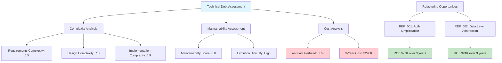

# Technical Debt Assessment

## Introduction
This workflow prompt performs comprehensive technical debt assessment based on specification complexity, design maintainability, and architectural patterns. It quantifies technical debt, identifies refactoring opportunities, calculates long-term maintenance costs, and generates prioritized improvement recommendations to enhance system sustainability and development velocity.

**Intent**: Proactively identify, quantify, and manage technical debt to maintain code quality and development efficiency over time.

**Context**: Use when assessing feature specifications for maintainability, planning refactoring initiatives, evaluating architectural decisions, or conducting technical health audits.

## Constraints and Guidelines

### Input Requirements
- **MANDATORY**: Feature specification directory with requirements, design, and implementation task documents
- **OPTIONAL**: Assessment focus (complexity-analysis, maintainability-focus, architectural-debt, comprehensive-assessment)
- **OPTIONAL**: Existing codebase context (legacy constraints, technology stack, team expertise)
- **OPTIONAL**: Business timeline constraints and refactoring budget allocation
- **OPTIONAL**: Quality targets and technical debt reduction goals

### Processing Constraints
1. **Debt Quantification Scope**: Analyze all aspects of technical debt from specification through implementation
2. **Maintainability Assessment**: Evaluate long-term maintenance complexity and evolution difficulty
3. **Refactoring Feasibility**: Ensure recommendations are practical given project constraints and timelines
4. **Cost-Benefit Analysis**: Provide clear ROI calculations for technical debt reduction efforts
5. **Risk Assessment**: Evaluate risks of leaving technical debt unaddressed vs. refactoring costs

### Output Constraints
1. **Quantified Metrics**: Provide measurable technical debt scores and maintenance cost estimates
2. **Prioritized Recommendations**: Generate actionable refactoring recommendations with priority ranking
3. **Implementation Roadmaps**: Create detailed refactoring plans with effort estimates and timelines
4. **Risk Mitigation**: Identify risks and provide mitigation strategies for technical debt areas
5. **Monitoring Framework**: Define metrics and monitoring for ongoing technical debt management

## Technical Debt Assessment Process

### Phase 1: Specification Complexity Analysis and Debt Identification

**Requirements Complexity Assessment:**
1. Analyze acceptance criteria complexity and interdependencies
2. Identify overly complex or conflicting requirements that increase implementation debt
3. Assess requirement volatility and change frequency impact on maintainability
4. Evaluate requirements clarity and potential for misinterpretation

**Design Complexity Evaluation:**
1. **Architectural Complexity**: Assess component coupling, cohesion, and dependency patterns
2. **Interface Complexity**: Evaluate API design complexity and integration burden
3. **Data Model Complexity**: Analyze data structure complexity and normalization issues
4. **Technology Stack Complexity**: Assess technology choices and their long-term implications

**Implementation Task Complexity:**
1. Analyze task breakdown granularity and implementation approach complexity
2. Identify tasks with high implementation risk or uncertainty
3. Assess testing complexity and validation difficulty
4. Evaluate deployment and operational complexity

**Debt Pattern Recognition:**
1. Identify common technical debt patterns in specifications:
   - Over-engineering vs. under-engineering
   - Tight coupling between components
   - Inconsistent design patterns
   - Missing abstraction layers
   - Inadequate error handling strategies

**Output Requirements:**
- Comprehensive complexity analysis with quantified debt scores
- Technical debt pattern identification with impact assessment
- Requirements and design maintainability evaluation
- Implementation complexity risk assessment

### Phase 2: Maintainability and Evolution Difficulty Analysis

**Code Maintainability Projection:**
1. Analyze design patterns for maintainability impact
2. Assess component modularity and separation of concerns
3. Evaluate naming conventions and documentation adequacy
4. Predict maintenance effort for common change scenarios

**Evolution and Extensibility Assessment:**
1. **Feature Extensibility**: Evaluate how easily new features can be added
2. **Scalability Maintainability**: Assess maintenance complexity under load growth
3. **Technology Evolution**: Evaluate adaptation difficulty for technology updates
4. **Team Knowledge Transfer**: Assess documentation and knowledge sharing adequacy

**Change Impact Analysis:**
1. Identify high-impact change areas that affect multiple components
2. Assess ripple effect potential for common modifications
3. Evaluate testing burden for change validation
4. Analyze deployment complexity for updates and rollbacks

**Technical Debt Accumulation Patterns:**
1. Identify areas prone to debt accumulation over time
2. Assess shortcuts and temporary solutions that may become permanent
3. Evaluate pressure points where debt is likely to increase
4. Analyze team practices that contribute to debt accumulation

**Output Requirements:**
- Maintainability scoring with specific improvement areas
- Evolution difficulty assessment with extensibility recommendations
- Change impact analysis with high-risk area identification
- Technical debt accumulation prediction with prevention strategies

### Phase 3: Long-term Maintenance Cost Calculation

**Development Velocity Impact Assessment:**
1. Calculate current development velocity impact from technical debt
2. Project future velocity degradation if debt remains unaddressed
3. Estimate time overhead for working around technical debt
4. Assess bug fix and maintenance effort multipliers

**Resource Cost Analysis:**
1. **Developer Time Costs**: Calculate additional time required for maintenance tasks
2. **Training and Onboarding Costs**: Assess complexity impact on new team member productivity
3. **Testing and QA Costs**: Evaluate additional testing effort required for complex areas
4. **Operational Costs**: Assess monitoring, troubleshooting, and support overhead

**Risk Cost Evaluation:**
1. **Bug Risk Costs**: Estimate potential costs from increased defect rates
2. **Security Risk Costs**: Assess security vulnerability risks from debt accumulation
3. **Performance Risk Costs**: Evaluate performance degradation and scaling costs
4. **Compliance Risk Costs**: Assess audit and compliance overhead from complex systems

**Total Cost of Ownership Projection:**
1. Calculate 3-year TCO impact of current technical debt levels
2. Project cost escalation if debt continues to accumulate
3. Compare debt service costs vs. refactoring investment
4. Assess opportunity costs from reduced development capacity

**Output Requirements:**
- Detailed maintenance cost breakdown with time and resource impact
- TCO projection with debt accumulation scenarios
- Risk cost assessment with mitigation cost comparisons
- ROI analysis for technical debt reduction investments

### Phase 4: Refactoring Opportunity Identification and Prioritization

**Refactoring Opportunity Analysis:**
1. **Architectural Refactoring**: Identify opportunities to improve system architecture
2. **Component Refactoring**: Find overly complex components that need simplification
3. **Interface Refactoring**: Identify API and integration improvements
4. **Data Model Refactoring**: Assess database and data structure optimization opportunities

**Refactoring Impact Assessment:**
1. **Complexity Reduction**: Calculate complexity reduction potential for each opportunity
2. **Maintainability Improvement**: Assess long-term maintainability gains
3. **Performance Impact**: Evaluate performance improvements from refactoring
4. **Development Velocity Improvement**: Calculate productivity gains from debt reduction

**Refactoring Effort Estimation:**
1. **Implementation Effort**: Estimate development time for refactoring implementation
2. **Testing Effort**: Calculate comprehensive testing requirements for refactored components
3. **Migration Effort**: Assess data migration and transition complexity
4. **Risk Mitigation Effort**: Include effort for risk management and rollback procedures

**Prioritization Framework:**
1. **Impact vs. Effort Matrix**: Plot refactoring opportunities by impact and implementation effort
2. **Risk-Based Prioritization**: Prioritize based on risk reduction potential
3. **Business Value Alignment**: Align refactoring priorities with business objectives
4. **Dependency-Based Sequencing**: Order refactoring based on component dependencies

**Output Requirements:**
- Comprehensive refactoring opportunity catalog with impact analysis
- Effort estimation for each refactoring opportunity with risk assessment
- Priority matrix with recommended implementation sequence
- Business value alignment with ROI calculations for each opportunity

### Phase 5: Technical Debt Management Strategy and Implementation Planning

**Debt Reduction Roadmap:**
1. **Phase 1 - Critical Debt**: Address debt that blocks development or poses significant risks
2. **Phase 2 - High-Impact Debt**: Target debt with highest ROI for reduction efforts
3. **Phase 3 - Strategic Debt**: Address architectural improvements and long-term sustainability
4. **Phase 4 - Optimization Debt**: Fine-tune and optimize for performance and maintainability

**Implementation Strategy:**
1. **Incremental Refactoring**: Plan small, safe refactoring steps with continuous validation
2. **Parallel Development**: Coordinate refactoring with ongoing feature development
3. **Risk Mitigation**: Implement comprehensive testing and rollback procedures
4. **Team Coordination**: Plan team allocation and knowledge transfer for refactoring efforts

**Monitoring and Progress Tracking:**
1. **Debt Metrics Dashboard**: Define KPIs for technical debt tracking and reduction progress
2. **Quality Gates**: Establish quality gates to prevent new debt accumulation
3. **Automated Monitoring**: Implement automated code quality and complexity monitoring
4. **Regular Assessment**: Schedule periodic technical debt reassessment and strategy updates

**Prevention Strategies:**
1. **Development Practices**: Implement practices to prevent technical debt accumulation
2. **Code Review Standards**: Establish review criteria focused on maintainability and simplicity
3. **Architectural Guidelines**: Define architectural principles to guide future development
4. **Technical Debt Budgeting**: Allocate ongoing capacity for technical debt management

**Output Requirements:**
- Comprehensive debt reduction roadmap with phased implementation plan
- Risk mitigation strategies with rollback procedures and testing requirements
- Monitoring framework with KPIs and automated tracking systems
- Prevention strategy with development practices and governance procedures

## Technical Debt Assessment Output Schema

### Assessment Report Structure
```json
{
  "assessment_timestamp": "2025-07-22T22:30:00Z",
  "feature_id": "user-management-system",
  "assessment_scope": "comprehensive-assessment",
  "baseline_complexity_score": 7.2,
  
  "debt_summary": {
    "overall_debt_score": 6.8,
    "debt_level": "medium-high",
    "critical_debt_areas": 3,
    "high_priority_refactoring_opportunities": 8,
    "estimated_annual_maintenance_overhead": "35%",
    "projected_3_year_debt_cost": "$240,000"
  },
  
  "complexity_analysis": {
    "requirements_complexity": {
      "complexity_score": 6.5,
      "complexity_factors": [
        {
          "factor": "interdependent_requirements",
          "impact": "high",
          "description": "15 requirements with circular dependencies",
          "debt_contribution": "25%"
        },
        {
          "factor": "ambiguous_acceptance_criteria",
          "impact": "medium",
          "description": "8 requirements with unclear success criteria",
          "debt_contribution": "15%"
        }
      ]
    },
    "design_complexity": {
      "complexity_score": 7.8,
      "architectural_debt": [
        {
          "area": "user_authentication_service",
          "complexity_score": 8.5,
          "debt_type": "over_engineering",
          "description": "Unnecessarily complex authentication flow with 12 decision points",
          "maintenance_impact": "high",
          "refactoring_priority": "high"
        },
        {
          "area": "data_access_layer",
          "complexity_score": 7.2,
          "debt_type": "tight_coupling",
          "description": "Direct database dependencies in business logic components",
          "maintenance_impact": "medium",
          "refactoring_priority": "medium"
        }
      ]
    },
    "implementation_complexity": {
      "complexity_score": 6.9,
      "task_complexity_distribution": {
        "low_complexity": 8,
        "medium_complexity": 12,
        "high_complexity": 6,
        "very_high_complexity": 2
      },
      "high_risk_tasks": [
        {
          "task_id": "3.4",
          "complexity_score": 9.1,
          "risk_factors": ["unclear requirements", "external dependencies", "performance constraints"],
          "debt_risk": "high"
        }
      ]
    }
  },
  
  "maintainability_assessment": {
    "current_maintainability_score": 5.8,
    "maintainability_factors": [
      {
        "factor": "component_coupling",
        "score": 4.2,
        "impact": "high",
        "improvement_potential": "significant",
        "recommended_action": "Implement dependency injection and interface abstraction"
      },
      {
        "factor": "code_documentation",
        "score": 7.1,
        "impact": "medium",
        "improvement_potential": "moderate",
        "recommended_action": "Add architectural decision records and API documentation"
      }
    ],
    "evolution_difficulty": {
      "feature_extensibility": "difficult",
      "scalability_adaptation": "moderate",
      "technology_migration": "very_difficult",
      "team_knowledge_transfer": "difficult"
    }
  },
  
  "cost_analysis": {
    "current_maintenance_overhead": {
      "development_velocity_impact": "35% slower",
      "bug_fix_time_multiplier": 2.3,
      "feature_delivery_delay": "average 2.5 weeks additional",
      "testing_overhead": "40% additional effort"
    },
    "projected_costs": {
      "year_1_maintenance_cost": "$80,000",
      "year_2_maintenance_cost": "$95,000",
      "year_3_maintenance_cost": "$115,000",
      "total_3_year_cost": "$290,000"
    },
    "risk_costs": {
      "security_vulnerability_risk": "$50,000 potential impact",
      "performance_degradation_risk": "$30,000 potential impact",
      "compliance_audit_overhead": "$20,000 annual additional cost"
    }
  },
  
  "refactoring_opportunities": [
    {
      "opportunity_id": "REF_001",
      "area": "authentication_service_simplification",
      "type": "architectural_refactoring",
      "complexity_reduction_potential": "60%",
      "maintenance_improvement": "45%",
      "implementation_effort": "120 hours",
      "risk_level": "medium",
      "roi_calculation": {
        "investment_cost": "$18,000",
        "annual_savings": "$15,000",
        "payback_period": "14.4 months",
        "3_year_net_benefit": "$27,000"
      },
      "priority_score": 8.7,
      "dependencies": ["database_abstraction_layer"],
      "implementation_phases": [
        {
          "phase": 1,
          "description": "Extract authentication interfaces",
          "effort": "40 hours",
          "risk": "low"
        },
        {
          "phase": 2,
          "description": "Implement simplified authentication flow",
          "effort": "60 hours",
          "risk": "medium"
        },
        {
          "phase": 3,
          "description": "Migrate existing integrations",
          "effort": "20 hours",
          "risk": "low"
        }
      ]
    },
    {
      "opportunity_id": "REF_002",
      "area": "data_access_layer_abstraction",
      "type": "component_refactoring",
      "complexity_reduction_potential": "40%",
      "maintenance_improvement": "35%",
      "implementation_effort": "80 hours",
      "risk_level": "low",
      "roi_calculation": {
        "investment_cost": "$12,000",
        "annual_savings": "$12,000",
        "payback_period": "12 months",
        "3_year_net_benefit": "$24,000"
      },
      "priority_score": 7.9
    }
  ],
  
  "implementation_roadmap": {
    "phase_1_critical_debt": {
      "duration": "6 weeks",
      "focus": "Security vulnerabilities and performance bottlenecks",
      "opportunities": ["REF_003", "REF_005"],
      "expected_debt_reduction": "25%",
      "investment": "$35,000"
    },
    "phase_2_high_impact": {
      "duration": "8 weeks",
      "focus": "Architectural improvements with highest ROI",
      "opportunities": ["REF_001", "REF_002"],
      "expected_debt_reduction": "40%",
      "investment": "$30,000"
    },
    "phase_3_strategic": {
      "duration": "10 weeks",
      "focus": "Long-term maintainability and extensibility",
      "opportunities": ["REF_004", "REF_006", "REF_007"],
      "expected_debt_reduction": "25%",
      "investment": "$45,000"
    }
  },
  
  "monitoring_framework": {
    "debt_metrics": [
      {
        "metric": "cyclomatic_complexity",
        "current_value": 8.2,
        "target_value": "< 6.0",
        "monitoring_frequency": "weekly",
        "alert_threshold": "> 7.5"
      },
      {
        "metric": "coupling_index",
        "current_value": 7.1,
        "target_value": "< 5.0",
        "monitoring_frequency": "bi-weekly",
        "alert_threshold": "> 6.5"
      }
    ],
    "quality_gates": [
      {
        "gate": "pull_request_complexity_check",
        "criteria": "No single component > complexity 7",
        "enforcement": "blocking"
      },
      {
        "gate": "architecture_review_gate",
        "criteria": "Architectural changes require debt impact assessment",
        "enforcement": "mandatory_review"
      }
    ]
  },
  
  "prevention_strategy": {
    "development_practices": [
      {
        "practice": "complexity_budgeting",
        "description": "Allocate 20% of sprint capacity to technical debt reduction",
        "implementation": "Sprint planning process integration"
      },
      {
        "practice": "architectural_decision_records",
        "description": "Document all architectural decisions with debt impact analysis",
        "implementation": "ADR template with debt assessment section"
      }
    ],
    "automated_governance": [
      {
        "tool": "complexity_analysis_ci",
        "description": "Automated complexity analysis in CI/CD pipeline",
        "enforcement": "Fail build if complexity thresholds exceeded"
      }
    ]
  }
}
```

### Technical Debt Visualization


## Usage Examples

### Example 1: Legacy System Assessment
**Input**: Large legacy system with 50+ components
**Scope**: comprehensive-assessment with architectural focus
**Output**: Complete debt analysis, $500K 3-year cost projection, prioritized refactoring roadmap

### Example 2: New Feature Debt Prevention
**Input**: New feature specification before implementation
**Scope**: complexity-analysis with prevention focus
**Output**: Complexity assessment, design simplification recommendations, debt prevention guidelines

### Example 3: Performance-Critical System Optimization
**Input**: High-performance system with scaling challenges
**Scope**: maintainability-focus with performance emphasis
**Output**: Performance debt analysis, optimization opportunities, scalability improvement plan

### Example 4: Team Velocity Improvement
**Input**: Team reporting 40% velocity decline
**Scope**: comprehensive-assessment with velocity focus
**Output**: Velocity impact analysis, debt reduction priorities, development process improvements

## Integration Points

### Workflow Integration
- **Input**: Validated specifications from review and cross-feature analysis
- **Output**: Technical debt insights feed into refactoring planning and architecture decisions
- **Dependencies**: Specification parsing, complexity analysis, cost modeling
- **Triggers**: Architecture reviews, performance concerns, team velocity issues

### Development Process Integration
- **CI/CD Integration**: Automated complexity monitoring and debt threshold enforcement
- **Code Review**: Debt impact assessment in code review processes
- **Sprint Planning**: Technical debt backlog integration with feature development
- **Architecture Reviews**: Systematic debt assessment in architectural decision making

### Quality Management Integration
- **Quality Metrics**: Integration with code quality and maintainability tracking
- **Risk Management**: Technical debt risk assessment and mitigation planning
- **Cost Management**: TCO analysis and refactoring investment planning
- **Performance Monitoring**: Correlation between technical debt and system performance

This prompt provides comprehensive technical debt assessment with quantified recommendations for maintaining system health and development velocity over time.
