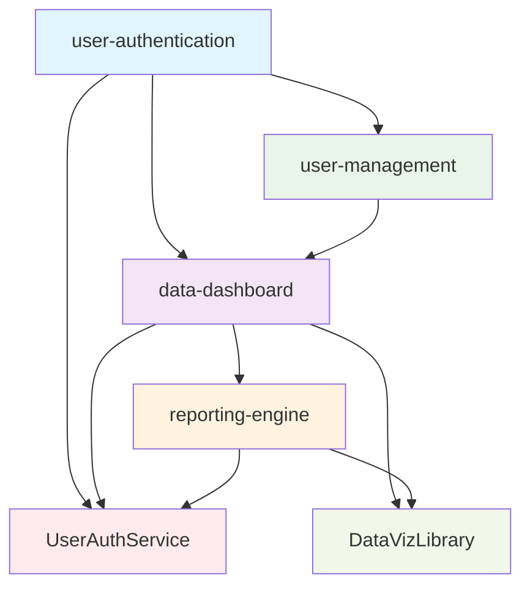

# Cross-Feature Integration Management

## Introduction
This workflow prompt analyzes multiple feature specifications to identify dependencies, conflicts, and integration requirements across features. It generates dependency graphs, detects conflicting requirements, identifies shared components, and provides integration sequencing recommendations to ensure smooth multi-feature development coordination.

**Intent**: Enable seamless integration of multiple features by proactively identifying and resolving cross-feature dependencies and conflicts.

**Context**: Use when managing multi-feature projects, planning feature release sequences, or analyzing integration complexity for large-scale development efforts.

## Constraints and Guidelines

### Input Requirements
- **MANDATORY**: Multiple feature specification directories (minimum 2 features for meaningful analysis)
- **OPTIONAL**: Integration scope preference (dependencies-only, conflicts-focus, shared-components, full-analysis)
- **OPTIONAL**: Project architecture context (microservices, monolith, hybrid)
- **OPTIONAL**: Release timeline constraints and priority ordering
- **OPTIONAL**: Existing system components and integration patterns

### Processing Constraints
1. **Multi-Feature Analysis**: Analyze dependencies and interactions between all provided feature specifications
2. **Conflict Detection**: Identify competing requirements, resource conflicts, and architectural inconsistencies
3. **Shared Component Identification**: Detect opportunities for component reuse and shared interface requirements
4. **Integration Sequencing**: Generate optimal feature implementation order based on dependency analysis
5. **Risk Assessment**: Evaluate integration complexity and identify high-risk integration points

### Output Constraints
1. **Visual Dependency Mapping**: Generate clear dependency graphs and relationship diagrams
2. **Conflict Resolution**: Provide specific recommendations for resolving identified conflicts
3. **Implementation Roadmap**: Create sequenced implementation plan with milestone dependencies
4. **Shared Component Specifications**: Define common interfaces and shared component requirements
5. **Integration Testing Strategy**: Recommend integration testing approaches for multi-feature scenarios

## Cross-Feature Analysis Process

### Phase 1: Feature Discovery and Metadata Extraction

**Multi-Feature Specification Loading:**
1. Discover and parse all feature specifications in provided directories
2. Extract feature metadata, requirements, design components, and implementation tasks
3. Build comprehensive feature inventory with completion status and complexity metrics
4. Identify feature relationships through explicit references and implicit dependencies

**Feature Classification and Prioritization:**
1. Classify features by type (core, supporting, enhancement, integration)
2. Assess feature complexity and implementation effort requirements
3. Identify business priority and timeline constraints for each feature
4. Determine feature interdependencies and standalone capabilities

**Cross-Reference Analysis:**
1. Parse all specification documents for cross-feature references
2. Identify explicit dependencies mentioned in requirements or design documents
3. Detect implicit dependencies through shared data models, APIs, or components
4. Build initial dependency relationship mapping

**Output Requirements:**
- Complete feature inventory with metadata and classification
- Initial dependency relationship mapping
- Feature complexity and priority assessment matrix
- Cross-reference analysis report

### Phase 2: Dependency Graph Generation and Analysis

**Dependency Relationship Mapping:**
1. Generate comprehensive dependency graph showing all feature relationships:
   - Direct dependencies (Feature A requires Feature B)
   - Indirect dependencies (Feature A → Feature B → Feature C)
   - Bidirectional dependencies (Features with mutual requirements)
   - Optional dependencies (Features with conditional relationships)
2. Calculate dependency depth and complexity metrics for each feature
3. Identify critical path features that block multiple other features
4. Detect circular dependencies and potential deadlock scenarios

**Dependency Type Classification:**
1. **Data Dependencies**: Features requiring shared data models or databases
2. **API Dependencies**: Features requiring specific interfaces or service endpoints
3. **Component Dependencies**: Features sharing UI components, libraries, or modules
4. **Infrastructure Dependencies**: Features requiring shared infrastructure or deployment resources
5. **Business Logic Dependencies**: Features with interdependent business rules or workflows

**Critical Path Analysis:**
1. Identify features on the critical path for project completion
2. Calculate potential delays from dependency bottlenecks
3. Assess impact of feature delays on dependent features
4. Recommend parallel development opportunities and dependency decoupling strategies

**Output Requirements:**
- Visual dependency graph with relationship types and complexity indicators
- Critical path analysis with bottleneck identification
- Dependency classification matrix with resolution recommendations
- Parallel development opportunity assessment

### Phase 3: Conflict Detection and Resolution Analysis

**Requirement Conflict Analysis:**
1. Compare acceptance criteria across features for conflicting requirements:
   - Performance requirements (conflicting response time expectations)
   - Security requirements (contradictory access control needs)
   - Data requirements (incompatible data model expectations)
   - User experience requirements (conflicting interface paradigms)
2. Identify resource conflicts (shared databases, services, or infrastructure)
3. Detect architectural conflicts (incompatible design patterns or technology choices)
4. Analyze business rule conflicts (contradictory business logic requirements)

**Design Consistency Validation:**
1. Compare architectural approaches across features for consistency
2. Identify incompatible technology stack choices or framework selections
3. Detect conflicting API design patterns or data model structures
4. Validate consistent security models and authentication approaches

**Conflict Resolution Recommendations:**
1. **Requirement Harmonization**: Suggest unified requirements that satisfy all features
2. **Architecture Standardization**: Recommend consistent architectural patterns
3. **Resource Sharing Strategies**: Propose shared resource management approaches
4. **Phased Implementation**: Suggest implementation sequencing to resolve conflicts
5. **Abstraction Layer Introduction**: Recommend abstraction layers to decouple conflicting features

**Output Requirements:**
- Comprehensive conflict analysis report with specific conflict descriptions
- Conflict resolution recommendations with implementation approaches
- Architecture consistency assessment with standardization suggestions
- Resource conflict resolution strategies with sharing mechanisms

### Phase 4: Shared Component Identification and Interface Design

**Common Component Analysis:**
1. Identify components mentioned across multiple feature specifications:
   - User interface components (forms, navigation, data display)
   - Business logic components (validation, calculations, workflows)
   - Data access components (repositories, services, APIs)
   - Infrastructure components (logging, monitoring, security)
2. Analyze component usage patterns and customization requirements
3. Assess component abstraction opportunities and reusability potential
4. Identify component ownership and maintenance responsibility

**Shared Interface Design:**
1. Design common interfaces for identified shared components
2. Define API contracts that satisfy all consuming features
3. Specify data models and communication protocols for shared components
4. Create component interaction patterns and usage guidelines

**Component Integration Strategy:**
1. Recommend shared component development approach (library, service, module)
2. Define component versioning and backward compatibility strategies
3. Specify testing approaches for shared components across multiple features
4. Establish governance model for shared component evolution and maintenance

**Output Requirements:**
- Shared component inventory with usage analysis and reusability assessment
- Common interface specifications with API contracts and data models
- Component integration strategy with development and maintenance guidelines
- Shared component testing and governance recommendations

### Phase 5: Integration Sequencing and Implementation Planning

**Optimal Implementation Sequencing:**
1. Calculate optimal feature implementation order based on:
   - Dependency requirements and blocking relationships
   - Business priority and timeline constraints
   - Resource availability and team capacity
   - Risk assessment and complexity considerations
2. Identify features that can be developed in parallel
3. Recommend milestone-based implementation phases
4. Assess impact of sequence changes on overall project timeline

**Integration Milestone Planning:**
1. Define integration checkpoints where multiple features come together
2. Specify integration testing requirements and validation criteria
3. Plan integration environment setup and deployment sequences
4. Establish integration rollback procedures and risk mitigation strategies

**Resource Allocation and Team Coordination:**
1. Identify shared resources and potential team coordination requirements
2. Recommend team structure and responsibility assignment for cross-feature work
3. Suggest communication protocols and coordination mechanisms
4. Plan knowledge sharing and cross-team collaboration approaches

**Output Requirements:**
- Optimal implementation sequence with dependency-aware scheduling
- Integration milestone plan with testing and validation requirements
- Resource allocation recommendations with team coordination strategies
- Risk mitigation plan with rollback procedures and contingency options

## Integration Analysis Output Schema

### Cross-Feature Analysis Report Structure
```json
{
  "analysis_timestamp": "2025-07-22T16:45:00Z",
  "analyzed_features": ["user-authentication", "data-dashboard", "reporting-engine", "user-management"],
  "analysis_scope": "full-analysis",
  
  "feature_inventory": {
    "total_features": 4,
    "feature_classifications": {
      "core_features": ["user-authentication", "user-management"],
      "supporting_features": ["data-dashboard"],
      "enhancement_features": ["reporting-engine"]
    },
    "completion_status": {
      "complete_specifications": 3,
      "partial_specifications": 1,
      "missing_specifications": 0
    }
  },
  
  "dependency_analysis": {
    "dependency_graph": {
      "nodes": [
        {"id": "user-authentication", "type": "core", "complexity": "medium"},
        {"id": "user-management", "type": "core", "complexity": "high"},
        {"id": "data-dashboard", "type": "supporting", "complexity": "medium"},
        {"id": "reporting-engine", "type": "enhancement", "complexity": "high"}
      ],
      "edges": [
        {
          "source": "data-dashboard",
          "target": "user-authentication",
          "dependency_type": "api_dependency",
          "strength": "strong",
          "description": "Dashboard requires user authentication for access control"
        },
        {
          "source": "reporting-engine", 
          "target": "data-dashboard",
          "dependency_type": "data_dependency",
          "strength": "strong",
          "description": "Reporting engine consumes data from dashboard APIs"
        }
      ]
    },
    "critical_path": ["user-authentication", "data-dashboard", "reporting-engine"],
    "parallel_opportunities": [
      {
        "features": ["user-authentication", "user-management"],
        "parallelization_potential": "high",
        "shared_components": ["user data models", "authentication middleware"]
      }
    ]
  },
  
  "conflict_analysis": {
    "identified_conflicts": [
      {
        "conflict_id": "CONF_001",
        "conflict_type": "performance_requirement",
        "severity": "medium",
        "features": ["data-dashboard", "reporting-engine"],
        "description": "Conflicting response time requirements: dashboard needs <200ms, reporting allows <2s",
        "impact": "May require different caching strategies or API optimization approaches",
        "resolution_recommendation": {
          "approach": "tiered_performance_requirements",
          "description": "Implement different performance tiers for real-time vs. analytical queries",
          "implementation_effort": "medium"
        }
      }
    ],
    "resolution_strategies": {
      "requirement_harmonization": 2,
      "architecture_standardization": 1,
      "phased_implementation": 1
    }
  },
  
  "shared_components": {
    "identified_components": [
      {
        "component_name": "UserAuthenticationService",
        "consuming_features": ["user-authentication", "data-dashboard", "reporting-engine"],
        "component_type": "service",
        "reusability_score": 95,
        "interface_specification": {
          "methods": ["authenticate", "authorize", "validateSession"],
          "data_models": ["User", "Session", "Permission"],
          "api_contract": "/auth/v1/authenticate"
        }
      },
      {
        "component_name": "DataVisualizationLibrary", 
        "consuming_features": ["data-dashboard", "reporting-engine"],
        "component_type": "library",
        "reusability_score": 87,
        "customization_requirements": {
          "chart_types": ["dashboard: real-time charts", "reporting: static charts"],
          "styling": ["dashboard: interactive", "reporting: print-friendly"]
        }
      }
    ],
    "development_strategy": {
      "shared_first": ["UserAuthenticationService"],
      "feature_first_then_extract": ["DataVisualizationLibrary"],
      "governance_model": "shared_component_team"
    }
  },
  
  "implementation_roadmap": {
    "optimal_sequence": [
      {
        "phase": 1,
        "duration": "4 weeks",
        "features": ["user-authentication", "user-management"],
        "parallel_development": true,
        "milestones": ["Authentication API complete", "User management backend ready"],
        "integration_points": ["Shared user data models", "Common authentication middleware"]
      },
      {
        "phase": 2,
        "duration": "3 weeks", 
        "features": ["data-dashboard"],
        "dependencies": ["user-authentication"],
        "milestones": ["Dashboard API integration", "User interface complete"],
        "integration_testing": ["Authentication integration", "Data access patterns"]
      },
      {
        "phase": 3,
        "duration": "5 weeks",
        "features": ["reporting-engine"],
        "dependencies": ["data-dashboard"],
        "milestones": ["Reporting API integration", "Performance optimization"],
        "integration_testing": ["Cross-feature data flow", "Performance benchmarking"]
      }
    ],
    "total_timeline": "12 weeks",
    "critical_dependencies": 3,
    "integration_complexity": "medium-high"
  },
  
  "integration_testing_strategy": {
    "integration_phases": [
      {
        "phase": "auth_integration",
        "features": ["user-authentication", "data-dashboard"],
        "test_scenarios": ["User login flow", "Session management", "Access control"],
        "automation_priority": "high"
      },
      {
        "phase": "data_integration",
        "features": ["data-dashboard", "reporting-engine"],
        "test_scenarios": ["Data flow consistency", "API compatibility", "Performance validation"],
        "automation_priority": "medium"
      }
    ],
    "cross_feature_test_coverage": {
      "integration_scenarios": 15,
      "end_to_end_workflows": 8,
      "performance_benchmarks": 5,
      "security_validations": 6
    }
  },
  
  "risk_assessment": {
    "high_risk_areas": [
      {
        "risk_id": "RISK_001",
        "category": "integration_complexity",
        "description": "Complex data synchronization between dashboard and reporting engine",
        "probability": "medium",
        "impact": "high",
        "mitigation_strategy": "Implement event-driven architecture with message queuing"
      }
    ],
    "overall_risk_level": "medium",
    "confidence_score": 82
  }
}
```

### Dependency Graph Visualization Format


## Usage Examples

### Example 1: Large Multi-Feature Project
**Input**: 8 interconnected features for enterprise application
**Scope**: full-analysis
**Output**: Complete dependency analysis, 15-week implementation roadmap, shared component library design

### Example 2: Microservices Integration Planning
**Input**: 5 microservice features with API dependencies
**Scope**: dependencies-focus
**Output**: Service dependency graph, API contract specifications, deployment sequencing plan

### Example 3: Conflict Resolution Focus
**Input**: 3 features with competing performance requirements
**Scope**: conflicts-focus
**Output**: Detailed conflict analysis, resolution strategies, harmonized requirements specification

### Example 4: Legacy System Integration
**Input**: 4 new features integrating with existing system
**Scope**: shared-components
**Output**: Integration layer design, shared component identification, migration strategy

## Integration Points

### Workflow Integration
- **Input**: Validated specifications from multiple features
- **Output**: Integration roadmap feeds into implementation planning and execution
- **Dependencies**: Specification discovery engine, validation results, shared utilities
- **Triggers**: When multiple features are ready for coordinated implementation

### Development Process Integration
- **Project Management**: Integration with sprint planning and resource allocation
- **CI/CD Integration**: Automated dependency validation and integration testing
- **Documentation**: Cross-feature documentation generation and maintenance
- **Monitoring**: Integration health monitoring and dependency tracking

### Tool Ecosystem Integration
- **Architecture Tools**: Integration with architecture diagramming and modeling tools
- **Project Management**: Export to Jira, Azure DevOps, or similar project management platforms
- **Version Control**: Git-based dependency tracking and change impact analysis
- **Communication**: Slack/Teams integration for cross-team coordination notifications

This prompt enables effective coordination of multi-feature development by providing comprehensive analysis and actionable integration strategies.
