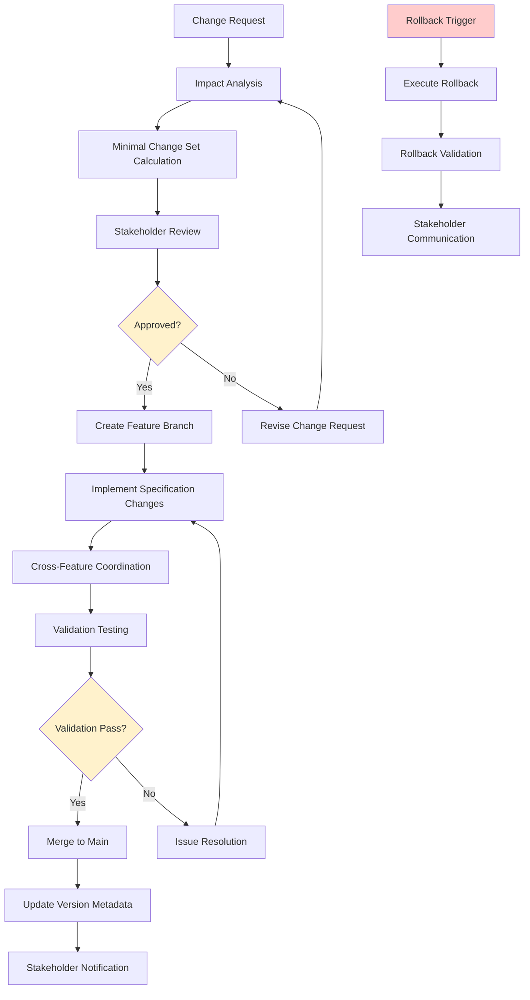

# Specification Evolution Management

## Introduction
This workflow prompt manages the evolution and change lifecycle of feature specifications, analyzing change impact across requirements-design-tasks, calculating minimal change sets, tracking specification versions, and generating rollback strategies. It ensures specification changes are well-coordinated and maintain system integrity throughout the development lifecycle.

**Intent**: Enable controlled, safe evolution of specifications while maintaining traceability and minimizing disruption to ongoing development.

**Context**: Use when modifying existing specifications, planning feature enhancements, managing specification versioning, or coordinating changes across dependent features.

## Constraints and Guidelines

### Input Requirements
- **MANDATORY**: Target specification directory with baseline version and proposed changes
- **OPTIONAL**: Change scope preference (requirements-only, design-updates, task-modifications, full-evolution)
- **OPTIONAL**: Impact analysis depth (immediate-dependencies, full-cascade, cross-project)
- **OPTIONAL**: Version control integration (git-based, manual-tracking, external-system)
- **OPTIONAL**: Change approval workflow requirements and stakeholder notification preferences

### Processing Constraints
1. **Change Impact Boundary**: Analyze all specification files within scope and their dependent features
2. **Version Integrity**: Maintain specification version consistency and traceability throughout changes
3. **Minimal Change Principle**: Calculate smallest possible change set that achieves desired outcomes
4. **Dependency Preservation**: Ensure changes don't break existing cross-feature dependencies
5. **Rollback Capability**: Generate complete rollback procedures for all proposed changes

### Output Constraints
1. **Change Impact Reports**: Provide detailed analysis of all affected specifications and dependencies
2. **Minimal Change Sets**: Generate precise change recommendations with specific file modifications
3. **Version Control Integration**: Create version-aware change tracking with branch and merge strategies
4. **Rollback Procedures**: Provide complete rollback instructions with validation checkpoints
5. **Stakeholder Communication**: Generate change notifications and approval request documentation

## Specification Evolution Process

### Phase 1: Change Request Analysis and Baseline Establishment

**Baseline Specification Analysis:**
1. Parse current specification state across all files (requirements.md, design.md, tasks.md)
2. Extract current version metadata, timestamps, and change history
3. Build comprehensive baseline inventory of all requirements, design elements, and tasks
4. Establish current cross-feature dependencies and external references

**Change Request Categorization:**
1. **Requirement Changes**: New requirements, modified acceptance criteria, deleted functionality
2. **Design Changes**: Architectural modifications, component updates, interface changes
3. **Task Changes**: Implementation approach updates, effort re-estimation, dependency modifications
4. **Cross-Cutting Changes**: Changes affecting multiple specification areas or external dependencies

**Change Complexity Assessment:**
1. Evaluate change scope and potential impact radius
2. Assess technical complexity and implementation effort changes
3. Identify stakeholders affected by proposed changes
4. Estimate timeline impact and resource requirement changes

**Output Requirements:**
- Complete baseline specification inventory with version metadata
- Categorized change request analysis with complexity assessment
- Stakeholder impact identification and notification requirements
- Change scope definition with boundary establishment

### Phase 2: Impact Propagation Analysis and Dependency Mapping

**Direct Impact Analysis:**
1. Identify immediate specification changes required by the change request
2. Map direct impacts to requirements, design components, and implementation tasks
3. Calculate effort and timeline changes for directly affected elements
4. Assess quality impact and additional validation requirements

**Cascade Impact Analysis:**
1. Trace change propagation through requirement-design-task linkages
2. Identify secondary changes required to maintain specification consistency
3. Analyze cross-feature dependency impacts and integration requirements
4. Assess ripple effects on testing strategies and validation approaches

**Cross-Feature Dependency Impact:**
1. Identify all features dependent on changed specifications
2. Analyze impact on shared components and common interfaces
3. Assess integration testing requirements and coordination needs
4. Evaluate timeline coordination requirements across dependent features

**Conflict and Inconsistency Detection:**
1. Identify potential conflicts between proposed changes and existing specifications
2. Detect inconsistencies that may arise from partial change implementation
3. Analyze compatibility with existing cross-feature dependencies
4. Identify orphaned elements that may result from changes

**Output Requirements:**
- Comprehensive impact propagation map with direct and cascade effects
- Cross-feature dependency impact analysis with coordination requirements
- Conflict and inconsistency identification with resolution recommendations
- Risk assessment for change implementation and potential issues

### Phase 3: Minimal Change Set Calculation and Optimization

**Change Set Optimization:**
1. Calculate minimal set of specification modifications to achieve desired outcomes
2. Identify redundant or unnecessary changes in the proposed modifications
3. Optimize change sequencing to minimize disruption and maintain consistency
4. Bundle related changes for atomic implementation and testing

**Alternative Change Strategy Analysis:**
1. Generate alternative approaches to achieve the same change objectives
2. Compare change strategies by complexity, risk, and implementation effort
3. Identify phased implementation options for complex changes
4. Recommend optimal change approach based on project constraints

**Change Effort Estimation:**
1. Estimate effort required for each change component:
   - Specification modification effort
   - Implementation impact and development changes
   - Testing and validation effort changes
   - Documentation and communication overhead
2. Calculate total change implementation timeline and resource requirements
3. Assess change implementation risk and mitigation strategies

**Change Validation Requirements:**
1. Define validation criteria for change implementation success
2. Specify testing requirements for changed specifications
3. Identify integration testing needs for cross-feature impacts
4. Establish acceptance criteria for change completion

**Output Requirements:**
- Optimized minimal change set with specific modification instructions
- Alternative change strategy analysis with recommendation rationale
- Comprehensive effort estimation with timeline and resource impacts
- Change validation requirements and success criteria definition

### Phase 4: Version Control Integration and Change Tracking

**Version Control Strategy:**
1. Generate version control branch strategy for change implementation
2. Create commit message templates and change documentation standards
3. Define merge strategy and integration testing requirements
4. Establish version tagging and release coordination procedures

**Change History and Traceability:**
1. Create comprehensive change history documentation
2. Establish linkage between change requests and implementation commits
3. Generate traceability matrix connecting changes to original requirements
4. Document change rationale and decision context for future reference

**Specification Version Management:**
1. Update specification metadata with new version information
2. Maintain backward compatibility documentation and migration guides
3. Create specification diff reports for change visualization
4. Establish specification archive and historical version access

**Integration with Development Workflow:**
1. Coordinate specification changes with development branch management
2. Establish specification review and approval gates
3. Create automated validation for specification consistency
4. Define integration points with CI/CD pipelines for change validation

**Output Requirements:**
- Complete version control strategy with branch and merge procedures
- Change history documentation with full traceability linkage
- Specification version management system with diff reporting
- Development workflow integration with automated validation gates

### Phase 5: Rollback Strategy and Change Recovery Planning

**Rollback Procedure Development:**
1. Create complete rollback procedures for all proposed changes
2. Define rollback validation checkpoints and success criteria
3. Establish rollback effort estimation and timeline requirements
4. Identify rollback dependencies and coordination requirements

**Change Recovery Scenarios:**
1. **Partial Implementation Rollback**: Procedures for incomplete change implementation
2. **Full Change Rollback**: Complete reversion to baseline specification state
3. **Selective Component Rollback**: Rollback specific change components while preserving others
4. **Emergency Rollback**: Rapid rollback procedures for critical issues

**Rollback Impact Analysis:**
1. Assess impact of rollback on dependent features and ongoing development
2. Identify coordination requirements for rollback across teams
3. Evaluate rollback effort and timeline requirements
4. Plan communication and stakeholder notification for rollback scenarios

**Rollback Validation and Testing:**
1. Define rollback validation procedures and success criteria
2. Establish testing requirements for post-rollback specification state
3. Create rollback verification checklists and quality gates
4. Plan regression testing for rollback impact validation

**Output Requirements:**
- Comprehensive rollback procedures with step-by-step instructions
- Rollback scenario planning with effort and coordination requirements
- Rollback impact analysis with stakeholder communication plans
- Rollback validation and testing procedures with success criteria

## Evolution Management Output Schema

### Change Impact Analysis Report Structure
```json
{
  "change_analysis_timestamp": "2025-07-22T18:20:00Z",
  "target_specification": "user-authentication",
  "baseline_version": "v2.1.0",
  "proposed_version": "v2.2.0",
  "change_scope": "requirements-design-updates",
  
  "change_request_summary": {
    "change_id": "CHG_AUTH_001",
    "change_type": "enhancement",
    "change_description": "Add multi-factor authentication support",
    "business_justification": "Enhanced security requirements for enterprise customers",
    "requested_by": "Product Management",
    "target_completion": "2025-09-15"
  },
  
  "baseline_analysis": {
    "current_requirements": 12,
    "current_design_components": 8,
    "current_tasks": 15,
    "cross_feature_dependencies": 4,
    "specification_completeness": 95.5,
    "last_major_change": "2025-06-10T14:30:00Z"
  },
  
  "impact_analysis": {
    "direct_impacts": {
      "requirements_changes": [
        {
          "change_type": "addition",
          "requirement_id": "1.8",
          "description": "Add MFA requirement for admin users",
          "impact_level": "medium",
          "effort_estimate": "4 hours"
        },
        {
          "change_type": "modification",
          "requirement_id": "1.2",
          "current": "THE SYSTEM SHALL authenticate users with username/password",
          "proposed": "THE SYSTEM SHALL authenticate users with username/password AND support optional MFA",
          "impact_level": "high",
          "effort_estimate": "8 hours"
        }
      ],
      "design_changes": [
        {
          "change_type": "addition",
          "component": "MFAService",
          "description": "New service for multi-factor authentication management",
          "impact_level": "high",
          "effort_estimate": "24 hours"
        }
      ],
      "task_modifications": [
        {
          "task_id": "2.3",
          "change_type": "modification",
          "description": "Expand authentication implementation to include MFA flows",
          "effort_change": "+16 hours",
          "timeline_impact": "+1 week"
        }
      ]
    },
    "cascade_impacts": {
      "affected_features": ["data-dashboard", "user-management", "reporting-engine"],
      "integration_changes": [
        {
          "feature": "data-dashboard",
          "impact_type": "interface_update",
          "description": "Update authentication integration to support MFA tokens",
          "effort_estimate": "6 hours"
        }
      ],
      "shared_component_impacts": [
        {
          "component": "UserAuthenticationService",
          "impact_type": "interface_extension",
          "description": "Extend authentication service interface for MFA methods",
          "breaking_change": false,
          "effort_estimate": "12 hours"
        }
      ]
    }
  },
  
  "minimal_change_set": {
    "change_optimization_summary": {
      "original_change_count": 23,
      "optimized_change_count": 18,
      "optimization_savings": "22% effort reduction",
      "bundled_changes": 3
    },
    "required_changes": [
      {
        "file": "requirements.md",
        "change_type": "addition",
        "location": "after requirement 1.7",
        "content": "1.8. THE SYSTEM SHALL support multi-factor authentication for admin users",
        "validation_required": true
      },
      {
        "file": "design.md", 
        "change_type": "addition",
        "location": "Authentication Architecture section",
        "content": "## Multi-Factor Authentication Service\n\nThe MFAService provides...",
        "integration_testing_required": true
      }
    ],
    "alternative_strategies": [
      {
        "strategy_name": "phased_implementation",
        "description": "Implement MFA in phases: basic MFA, then admin enforcement",
        "effort_reduction": "30%",
        "timeline_extension": "2 weeks",
        "risk_reduction": "significant"
      }
    ]
  },
  
  "version_control_strategy": {
    "branch_strategy": "feature/mfa-authentication",
    "merge_strategy": "squash_merge_after_review",
    "commit_template": "[CHG_AUTH_001] {description}\n\nImpacted files: {files}\nCross-feature coordination: {coordination}",
    "review_requirements": {
      "required_reviewers": ["tech_lead", "security_architect"],
      "approval_gates": ["specification_validation", "integration_testing"]
    }
  },
  
  "rollback_strategy": {
    "rollback_scenarios": [
      {
        "scenario": "implementation_issues",
        "trigger": "Technical implementation blockers discovered",
        "rollback_effort": "4 hours",
        "coordination_required": ["data-dashboard team", "user-management team"],
        "rollback_steps": [
          "Revert specification changes in feature branch",
          "Notify dependent feature teams",
          "Update project timeline and resource allocation"
        ]
      },
      {
        "scenario": "business_requirements_change",
        "trigger": "Business priorities shift, MFA no longer required",
        "rollback_effort": "2 hours",
        "rollback_steps": [
          "Archive MFA specifications for future reference",
          "Revert to baseline v2.1.0 specification",
          "Update feature roadmap and stakeholder communications"
        ]
      }
    ],
    "rollback_validation": {
      "specification_consistency_check": true,
      "cross_feature_dependency_validation": true,
      "regression_testing_required": false
    }
  },
  
  "timeline_and_effort_analysis": {
    "change_implementation_timeline": {
      "specification_updates": "1 day",
      "cross_feature_coordination": "2 days", 
      "validation_and_testing": "1 day",
      "total_timeline": "4 days"
    },
    "development_impact": {
      "additional_development_effort": "52 hours",
      "integration_testing_effort": "16 hours",
      "documentation_updates": "8 hours",
      "total_development_impact": "76 hours"
    },
    "risk_assessment": {
      "implementation_risk": "medium",
      "integration_risk": "low", 
      "timeline_risk": "low",
      "overall_confidence": "85%"
    }
  },
  
  "stakeholder_communication": {
    "notification_required": [
      {
        "stakeholder": "dependent_feature_teams",
        "notification_type": "coordination_required",
        "message": "MFA authentication changes require interface updates in your features"
      },
      {
        "stakeholder": "product_management",
        "notification_type": "timeline_update",
        "message": "MFA implementation will add 1 week to authentication feature timeline"
      }
    ],
    "approval_requirements": {
      "technical_approval": "Architecture review required",
      "business_approval": "Product owner sign-off required",
      "security_approval": "Security architect review required"
    }
  }
}
```

### Change Implementation Workflow


## Usage Examples

### Example 1: Major Feature Enhancement
**Input**: Adding payment processing to e-commerce feature
**Scope**: full-evolution with cross-project impact
**Output**: Complete change analysis, 15-feature impact assessment, phased implementation plan

### Example 2: API Breaking Change Management
**Input**: Authentication service interface modification
**Scope**: cross-feature coordination focus
**Output**: Dependency impact analysis, migration strategy, rollback procedures

### Example 3: Requirements Clarification
**Input**: Clarifying ambiguous acceptance criteria
**Scope**: requirements-only with minimal impact
**Output**: Targeted requirement updates, validation strategy, stakeholder communication

### Example 4: Emergency Change Management
**Input**: Critical security requirement addition
**Scope**: expedited change with emergency procedures
**Output**: Fast-track change analysis, emergency rollback procedures, accelerated validation

## Integration Points

### Workflow Integration
- **Input**: Validated specifications and change requests
- **Output**: Change implementation plans feed into development execution
- **Dependencies**: Cross-feature integration analysis, validation systems
- **Triggers**: Change requests, specification updates, version control events

### Development Process Integration
- **Version Control**: Git integration with automated change tracking
- **CI/CD Integration**: Automated specification validation and change impact analysis
- **Project Management**: Integration with change management and approval workflows
- **Communication**: Automated stakeholder notification and coordination

### Quality Assurance Integration
- **Change Validation**: Automated consistency checking and validation
- **Regression Testing**: Integration with testing strategies for change impact
- **Documentation**: Automated change documentation and history tracking
- **Audit Trail**: Complete traceability for compliance and governance requirements

This prompt enables controlled, safe evolution of specifications while maintaining system integrity and coordination across all dependent features and stakeholders.
