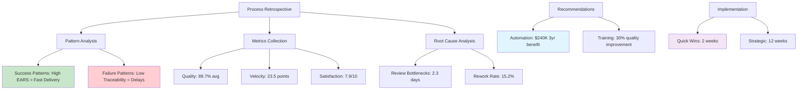

# Process Retrospective

## Introduction
This workflow prompt conducts comprehensive retrospective analysis of completed feature development cycles, collecting and analyzing metrics from specification quality through implementation success. It identifies patterns in specification effectiveness, implementation outcomes, and process improvements, generating actionable recommendations with measurable improvement targets to optimize future development workflows.

**Intent**: Enable continuous improvement of the specification-driven development process through data-driven insights and pattern recognition.

**Context**: Use after feature completion, at regular intervals for process assessment, during team retrospectives, or when optimizing development workflows for improved velocity and quality.

## Constraints and Guidelines

### Input Requirements
- **MANDATORY**: Completed feature specifications with implementation history and outcome data
- **OPTIONAL**: Analysis timeframe (single-feature, sprint-cycle, quarterly-assessment, annual-review)
- **OPTIONAL**: Focus areas (specification-quality, implementation-success, team-velocity, process-efficiency)
- **OPTIONAL**: Comparison baselines (historical data, team benchmarks, industry standards)
- **OPTIONAL**: Improvement targets and organizational objectives

### Processing Constraints
1. **Data Accuracy**: Only analyze verifiable metrics and outcomes from completed development cycles
2. **Pattern Recognition**: Identify statistically significant patterns and correlations in process data
3. **Actionable Insights**: Generate specific, implementable recommendations with measurable outcomes
4. **Bias Mitigation**: Account for external factors and avoid correlation-causation confusion
5. **Future Applicability**: Ensure recommendations are relevant to upcoming development work

### Output Constraints
1. **Quantified Analysis**: Provide measurable metrics and statistical analysis of process effectiveness
2. **Pattern Documentation**: Clearly document identified patterns with supporting evidence
3. **Prioritized Recommendations**: Generate improvement recommendations ranked by impact and feasibility
4. **Implementation Planning**: Provide specific steps and timelines for process improvements
5. **Success Metrics**: Define measurable criteria for evaluating improvement implementation success

## Process Retrospective Analysis

### Phase 1: Data Collection and Baseline Establishment

**Specification Quality Metrics Collection:**
1. **EARS Compliance Rates**: Collect EARS format compliance percentages across analyzed features
2. **Traceability Scores**: Gather requirement-design-task traceability coverage metrics
3. **Completeness Metrics**: Analyze specification completeness scores and gap frequencies
4. **Change Frequency**: Track specification change rates and modification patterns
5. **Review Cycle Data**: Collect specification review times and iteration counts

**Implementation Success Metrics:**
1. **Delivery Timeliness**: Analyze actual vs. estimated delivery timelines
2. **Quality Outcomes**: Collect defect rates, bug severity distributions, and post-release issues
3. **Scope Adherence**: Measure feature scope creep and requirement deviation rates
4. **Testing Effectiveness**: Analyze test coverage, test execution success rates, and defect detection
5. **User Acceptance**: Gather user feedback scores and feature adoption metrics

**Team Performance Indicators:**
1. **Development Velocity**: Track story points, feature completion rates, and cycle times
2. **Collaboration Metrics**: Analyze cross-team coordination effectiveness and communication patterns
3. **Knowledge Transfer**: Assess documentation quality and team knowledge distribution
4. **Technical Debt**: Track technical debt accumulation and resolution rates
5. **Team Satisfaction**: Collect developer experience and process satisfaction surveys

**Process Efficiency Measurements:**
1. **Workflow Bottlenecks**: Identify delays and blockers in the specification-to-delivery pipeline
2. **Rework Rates**: Measure specification and implementation rework frequency and causes
3. **Review Effectiveness**: Analyze review cycle efficiency and defect detection rates
4. **Automation Benefits**: Assess impact of automated validation and testing processes
5. **Resource Utilization**: Evaluate team capacity utilization and allocation effectiveness

**Output Requirements:**
- Comprehensive metrics database with historical trends and baselines
- Statistical analysis of specification quality correlation with implementation success
- Team performance indicators with velocity and satisfaction measurements
- Process efficiency analysis with bottleneck and improvement opportunity identification

### Phase 2: Pattern Recognition and Correlation Analysis

**Specification Quality Correlation Analysis:**
1. **Quality-Success Correlation**: Analyze correlation between specification quality scores and implementation success
2. **EARS Compliance Impact**: Measure impact of EARS format compliance on development velocity and defect rates
3. **Traceability Benefits**: Correlate traceability coverage with scope adherence and testing effectiveness
4. **Review Thoroughness**: Analyze relationship between review depth and final implementation quality

**Process Pattern Identification:**
1. **Success Patterns**: Identify common characteristics of highly successful feature implementations
2. **Failure Patterns**: Analyze common factors in delayed, over-budget, or quality-challenged deliveries
3. **Efficiency Patterns**: Recognize workflow patterns that consistently lead to faster, higher-quality outcomes
4. **Risk Patterns**: Identify early warning indicators for potential project challenges

**Team Performance Pattern Analysis:**
1. **High-Performance Indicators**: Identify team configurations and practices leading to optimal outcomes
2. **Collaboration Patterns**: Analyze effective cross-team coordination and communication patterns
3. **Learning Curve Patterns**: Track team improvement rates and knowledge acquisition patterns
4. **Workload Optimization**: Identify optimal work distribution and capacity utilization patterns

**External Factor Impact Assessment:**
1. **Technology Stack Influence**: Analyze impact of technology choices on development outcomes
2. **Project Complexity Factors**: Assess how feature complexity affects process effectiveness
3. **Timeline Pressure Impact**: Evaluate effects of schedule constraints on quality and process adherence
4. **Resource Constraint Effects**: Analyze impact of team size and skill mix on development outcomes

**Output Requirements:**
- Statistical correlation analysis with confidence intervals and significance testing
- Pattern documentation with specific examples and supporting evidence
- Risk factor identification with probability assessments and impact analysis
- External factor influence analysis with controllable vs. uncontrollable factor separation

### Phase 3: Root Cause Analysis and Improvement Opportunity Identification

**Process Bottleneck Root Cause Analysis:**
1. **Specification Bottlenecks**: Analyze causes of delays in specification creation and review cycles
2. **Implementation Bottlenecks**: Identify root causes of development delays and quality issues
3. **Communication Bottlenecks**: Assess barriers to effective team coordination and information sharing
4. **Tool and Infrastructure Bottlenecks**: Evaluate technology and process infrastructure limitations

**Quality Issue Root Cause Investigation:**
1. **Defect Source Analysis**: Trace defects back to specification, design, or implementation issues
2. **Requirement Ambiguity Analysis**: Identify sources and impacts of unclear or incomplete requirements
3. **Design Consistency Issues**: Analyze causes of design-implementation misalignment
4. **Testing Gap Analysis**: Identify root causes of insufficient test coverage and missed defects

**Process Improvement Opportunity Assessment:**
1. **Automation Opportunities**: Identify manual processes suitable for automation
2. **Standardization Benefits**: Assess opportunities for process and template standardization
3. **Training and Skill Development**: Identify team capability gaps and development opportunities
4. **Tool Enhancement Needs**: Evaluate tool chain improvements and integration opportunities

**Best Practice Identification:**
1. **High-Performance Practices**: Document practices consistently associated with successful outcomes
2. **Innovation Opportunities**: Identify novel approaches that produced exceptional results
3. **Scaling Strategies**: Assess practices that remain effective as team and project size increase
4. **Adaptability Factors**: Identify practices that work across different project types and constraints

**Output Requirements:**
- Root cause analysis documentation with evidence chains and impact assessment
- Improvement opportunity catalog with feasibility and impact analysis
- Best practice documentation with implementation guidelines and success criteria
- Innovation opportunity identification with experimentation and pilot planning

### Phase 4: Recommendation Generation and Prioritization

**Process Improvement Recommendations:**
1. **Specification Process Improvements**: Recommend enhancements to specification creation, review, and validation
2. **Implementation Process Optimization**: Suggest improvements to development workflow and quality gates
3. **Communication Enhancement**: Recommend tools and practices for improved team coordination
4. **Quality Assurance Improvements**: Suggest enhancements to testing, review, and validation processes

**Tool and Infrastructure Recommendations:**
1. **Automation Implementation**: Recommend specific automation tools and processes
2. **Integration Improvements**: Suggest tool chain integrations and workflow optimizations
3. **Monitoring and Analytics**: Recommend metrics collection and analysis improvements
4. **Infrastructure Enhancements**: Suggest development environment and CI/CD improvements

**Team Development Recommendations:**
1. **Skill Development**: Recommend training programs and capability building initiatives
2. **Role Optimization**: Suggest team structure and responsibility adjustments
3. **Collaboration Improvement**: Recommend practices and tools for enhanced team collaboration
4. **Knowledge Management**: Suggest improvements to documentation and knowledge sharing

**Recommendation Prioritization Framework:**
1. **Impact Assessment**: Calculate potential impact of each recommendation on key metrics
2. **Implementation Effort**: Estimate effort and resources required for recommendation implementation
3. **Risk Evaluation**: Assess implementation risks and potential negative consequences
4. **ROI Calculation**: Calculate return on investment for resource-intensive recommendations

**Output Requirements:**
- Prioritized recommendation list with impact and effort analysis
- Implementation planning with timelines, resources, and success criteria
- Risk assessment and mitigation strategies for recommended changes
- ROI analysis with cost-benefit calculations and payback period estimates

### Phase 5: Implementation Planning and Success Measurement

**Implementation Roadmap Development:**
1. **Quick Wins**: Identify low-effort, high-impact improvements for immediate implementation
2. **Strategic Initiatives**: Plan larger improvements requiring significant investment or organizational change
3. **Experimental Pilots**: Design pilot programs for testing novel approaches and practices
4. **Continuous Improvement**: Establish ongoing improvement processes and feedback loops

**Change Management Strategy:**
1. **Stakeholder Engagement**: Plan communication and buy-in strategies for process changes
2. **Training and Support**: Design training programs and support systems for new processes
3. **Gradual Rollout**: Plan phased implementation to minimize disruption and enable learning
4. **Resistance Management**: Identify potential resistance sources and mitigation strategies

**Success Measurement Framework:**
1. **Key Performance Indicators**: Define specific KPIs for measuring improvement success
2. **Baseline Establishment**: Document current state metrics for comparison
3. **Monitoring Plan**: Establish regular measurement and reporting schedules
4. **Feedback Mechanisms**: Create systems for collecting feedback on improvement effectiveness

**Continuous Improvement Process:**
1. **Regular Assessment**: Schedule periodic retrospective analysis and improvement evaluation
2. **Adaptation Mechanisms**: Establish processes for adjusting improvements based on results
3. **Learning Integration**: Create systems for capturing and sharing lessons learned
4. **Innovation Encouragement**: Establish programs for continuous experimentation and improvement

**Output Requirements:**
- Comprehensive implementation roadmap with timelines and resource allocation
- Change management plan with stakeholder engagement and support strategies
- Success measurement framework with KPIs and monitoring procedures
- Continuous improvement process with regular assessment and adaptation mechanisms

## Process Retrospective Output Schema

### Retrospective Analysis Report Structure
```json
{
  "retrospective_timestamp": "2025-07-23T00:30:00Z",
  "analysis_period": {
    "start_date": "2025-04-01",
    "end_date": "2025-07-22",
    "features_analyzed": 12,
    "total_development_cycles": 18
  },
  "analysis_scope": "quarterly-assessment",
  
  "baseline_metrics": {
    "specification_quality": {
      "average_ears_compliance": 87.3,
      "average_traceability_score": 91.2,
      "average_completeness": 89.7,
      "specification_change_rate": 2.4
    },
    "implementation_success": {
      "on_time_delivery_rate": 72.2,
      "scope_adherence_rate": 85.6,
      "defect_rate_per_feature": 3.8,
      "user_satisfaction_score": 7.8
    },
    "team_performance": {
      "average_velocity": 23.5,
      "cycle_time_days": 14.2,
      "collaboration_score": 8.1,
      "team_satisfaction": 7.9
    },
    "process_efficiency": {
      "review_cycle_time": 2.3,
      "rework_rate": 15.2,
      "automation_coverage": 68.5,
      "resource_utilization": 82.1
    }
  },
  
  "pattern_analysis": {
    "success_patterns": [
      {
        "pattern_id": "SP_001",
        "pattern_name": "high_ears_compliance_success",
        "description": "Features with >95% EARS compliance delivered 40% faster with 60% fewer defects",
        "statistical_significance": 0.02,
        "sample_size": 8,
        "correlation_strength": 0.73,
        "supporting_evidence": [
          "Feature A: 98% EARS, 12 days delivery, 1 defect",
          "Feature B: 96% EARS, 11 days delivery, 0 defects"
        ]
      },
      {
        "pattern_id": "SP_002",
        "pattern_name": "comprehensive_review_quality",
        "description": "Features with thorough specification reviews (3+ reviewers) had 50% fewer post-release issues",
        "statistical_significance": 0.01,
        "sample_size": 10,
        "correlation_strength": 0.68
      }
    ],
    "failure_patterns": [
      {
        "pattern_id": "FP_001",
        "pattern_name": "insufficient_traceability_delays",
        "description": "Features with <80% traceability experienced 35% longer implementation cycles",
        "statistical_significance": 0.03,
        "sample_size": 6,
        "correlation_strength": -0.61,
        "root_causes": [
          "Unclear requirement-design linkages",
          "Missing implementation task coverage",
          "Insufficient cross-reference validation"
        ]
      }
    ],
    "efficiency_patterns": [
      {
        "pattern_id": "EP_001",
        "pattern_name": "automated_validation_velocity",
        "description": "Teams using automated specification validation achieved 25% higher velocity",
        "implementation_examples": [
          "Team Alpha: Automated EARS validation, 28 velocity average",
          "Team Beta: Manual validation, 21 velocity average"
        ]
      }
    ]
  },
  
  "root_cause_analysis": {
    "primary_bottlenecks": [
      {
        "bottleneck": "specification_review_cycles",
        "impact": "Average 2.3 day delay per feature",
        "frequency": "83% of features affected",
        "root_causes": [
          "Insufficient reviewer availability",
          "Unclear review criteria and expectations",
          "Manual review process inefficiencies"
        ],
        "cost_impact": "$45,000 quarterly delay cost"
      },
      {
        "bottleneck": "requirement_ambiguity_rework",
        "impact": "15.2% rework rate",
        "frequency": "67% of features required rework",
        "root_causes": [
          "Incomplete EARS format adoption",
          "Insufficient stakeholder review",
          "Missing edge case documentation"
        ],
        "cost_impact": "$38,000 quarterly rework cost"
      }
    ],
    "quality_issue_sources": [
      {
        "source": "unclear_acceptance_criteria",
        "defect_contribution": "35%",
        "prevention_opportunity": "Enhanced EARS training and validation",
        "estimated_defect_reduction": "60%"
      }
    ]
  },
  
  "improvement_recommendations": [
    {
      "recommendation_id": "REC_001",
      "category": "process_automation",
      "title": "Implement Automated Specification Validation Pipeline",
      "description": "Deploy automated EARS compliance and traceability validation in CI/CD pipeline",
      "priority": "high",
      "impact_assessment": {
        "velocity_improvement": "25%",
        "quality_improvement": "40% defect reduction",
        "efficiency_gain": "30% review time reduction"
      },
      "implementation_plan": {
        "effort_estimate": "80 hours",
        "timeline": "6 weeks",
        "resources_required": ["DevOps Engineer", "Process Engineer"],
        "dependencies": ["CI/CD pipeline access", "Validation tool integration"]
      },
      "roi_analysis": {
        "implementation_cost": "$15,000",
        "annual_savings": "$85,000",
        "payback_period": "2.1 months",
        "3_year_net_benefit": "$240,000"
      },
      "success_metrics": [
        "EARS compliance rate > 95%",
        "Review cycle time < 1.5 days",
        "Rework rate < 8%"
      ]
    },
    {
      "recommendation_id": "REC_002",
      "category": "team_development",
      "title": "Enhanced EARS Format Training Program",
      "description": "Comprehensive training program for all team members on EARS format and best practices",
      "priority": "medium",
      "impact_assessment": {
        "specification_quality": "30% improvement",
        "requirement_clarity": "50% improvement"
      },
      "implementation_plan": {
        "effort_estimate": "40 hours",
        "timeline": "4 weeks",
        "resources_required": ["Training Coordinator", "Subject Matter Expert"],
        "training_modules": [
          "EARS Fundamentals",
          "Advanced EARS Patterns",
          "Quality Validation Techniques"
        ]
      }
    }
  ],
  
  "implementation_roadmap": {
    "quick_wins": [
      {
        "initiative": "Automated EARS validation",
        "timeline": "2 weeks",
        "effort": "low",
        "impact": "high"
      }
    ],
    "strategic_initiatives": [
      {
        "initiative": "Comprehensive process automation",
        "timeline": "12 weeks",
        "effort": "high",
        "impact": "very_high",
        "phases": [
          "Phase 1: Validation automation",
          "Phase 2: Review workflow optimization",
          "Phase 3: Metrics and monitoring integration"
        ]
      }
    ],
    "experimental_pilots": [
      {
        "experiment": "AI-assisted specification review",
        "duration": "8 weeks",
        "success_criteria": "20% review time reduction",
        "pilot_team": "Team Alpha"
      }
    ]
  },
  
  "success_measurement": {
    "kpis": [
      {
        "metric": "specification_quality_score",
        "current_baseline": 89.7,
        "target": 95.0,
        "measurement_frequency": "weekly"
      },
      {
        "metric": "implementation_velocity",
        "current_baseline": 23.5,
        "target": 28.0,
        "measurement_frequency": "sprint"
      },
      {
        "metric": "defect_rate",
        "current_baseline": 3.8,
        "target": 2.0,
        "measurement_frequency": "monthly"
      }
    ],
    "monitoring_dashboard": {
      "update_frequency": "daily",
      "stakeholder_access": ["team_leads", "product_managers", "engineering_managers"],
      "alert_thresholds": {
        "quality_degradation": "< 85% specification quality",
        "velocity_decline": "< 20 story points average",
        "defect_spike": "> 5 defects per feature"
      }
    }
  },
  
  "continuous_improvement": {
    "assessment_schedule": "monthly mini-retrospectives, quarterly comprehensive analysis",
    "feedback_mechanisms": [
      "Weekly team pulse surveys",
      "Post-release feature retrospectives",
      "Quarterly stakeholder feedback sessions"
    ],
    "adaptation_triggers": [
      "KPI degradation beyond threshold",
      "New tool or process introduction",
      "Team structure or size changes"
    ],
    "innovation_programs": [
      "Monthly process improvement hackathons",
      "Quarterly best practice sharing sessions",
      "Annual process innovation challenges"
    ]
  }
}
```

### Process Improvement Tracking Dashboard


## Usage Examples

### Example 1: Team Performance Optimization
**Input**: 6-month development cycle data for team of 8 developers
**Scope**: comprehensive analysis with team velocity focus
**Output**: Velocity improvement recommendations, skill development plan, process optimization roadmap

### Example 2: Quality Improvement Initiative
**Input**: High-defect-rate period analysis across multiple features
**Scope**: quality-focused analysis with root cause investigation
**Output**: Quality improvement recommendations, prevention strategies, measurement framework

### Example 3: Organizational Process Standardization
**Input**: Multi-team comparison analysis across 20 features
**Scope**: process-efficiency with standardization focus
**Output**: Best practice identification, standardization recommendations, training program design

### Example 4: Continuous Improvement Program
**Input**: Quarterly retrospective for ongoing improvement tracking
**Scope**: trend analysis with continuous improvement focus
**Output**: Progress tracking, adaptation recommendations, innovation opportunity identification

## Integration Points

### Workflow Integration
- **Input**: Historical data from all previous workflow prompts and implementation outcomes
- **Output**: Process improvements feed back into workflow optimization and team development
- **Dependencies**: Metrics collection systems, historical data analysis, team feedback mechanisms
- **Triggers**: Feature completion, regular assessment schedules, performance concerns

### Organizational Learning Integration
- **Knowledge Management**: Integration with organizational learning and best practice repositories
- **Performance Management**: Feed insights into team performance evaluation and development planning
- **Strategic Planning**: Provide data for organizational development strategy and resource allocation
- **Benchmarking**: Enable comparison with industry standards and competitive analysis

### Continuous Improvement Integration
- **Feedback Loops**: Establish closed-loop improvement processes with measurement and adaptation
- **Change Management**: Integrate with organizational change management processes and training programs
- **Innovation Programs**: Connect with innovation initiatives and experimental process development
- **Quality Systems**: Align with quality management systems and improvement methodologies

This prompt enables data-driven continuous improvement of specification and development processes, ensuring ongoing optimization of team performance and delivery quality.
